<picture><source media="(prefers-color-scheme: dark)" srcset="assets/dark/header-v1.svg"/></picture>

<a href="https://dereksun.dev"><picture><source media="(prefers-color-scheme: dark)" srcset="https://img.shields.io/badge/PORTFOLIO-000000?style=flat-square&labelColor=000000&color=000000"/></picture></a>
<a href="https://www.linkedin.com/in/derek-sun/"><picture><source media="(prefers-color-scheme: dark)" srcset="https://img.shields.io/badge/LINKEDIN-000000?style=flat-square&labelColor=000000&color=000000"/></picture></a>
<a href="mailto:sunderek3602@gmail.com"><picture><source media="(prefers-color-scheme: dark)" srcset="https://img.shields.io/badge/EMAIL-000000?style=flat-square&labelColor=000000&color=000000"/></picture></a>
<a href="https://github.com/dereksun00"><picture><source media="(prefers-color-scheme: dark)" srcset="https://img.shields.io/badge/GITHUB-000000?style=flat-square&labelColor=000000&color=000000"/></picture></a>

<picture><source media="(prefers-color-scheme: dark)" srcset="assets/dark/s01.svg"/></picture>
<picture><source media="(prefers-color-scheme: dark)" srcset="assets/dark/whoami.svg"/></picture>

<picture><source media="(prefers-color-scheme: dark)" srcset="assets/dark/barbell.svg"/></picture>

<picture><source media="(prefers-color-scheme: dark)" srcset="assets/dark/s02.svg"/></picture>
<picture><source media="(prefers-color-scheme: dark)" srcset="assets/dark/projects.svg"/></picture>

<picture><source media="(prefers-color-scheme: dark)" srcset="assets/dark/s03.svg"/></picture>
<picture><source media="(prefers-color-scheme: dark)" srcset="assets/dark/experience.svg"/></picture>

<picture><source media="(prefers-color-scheme: dark)" srcset="assets/dark/s04.svg"/></picture>
<picture><source media="(prefers-color-scheme: dark)" srcset="assets/dark/stack.svg"/></picture>

<picture><source media="(prefers-color-scheme: dark)" srcset="assets/dark/footer.svg"/></picture>
